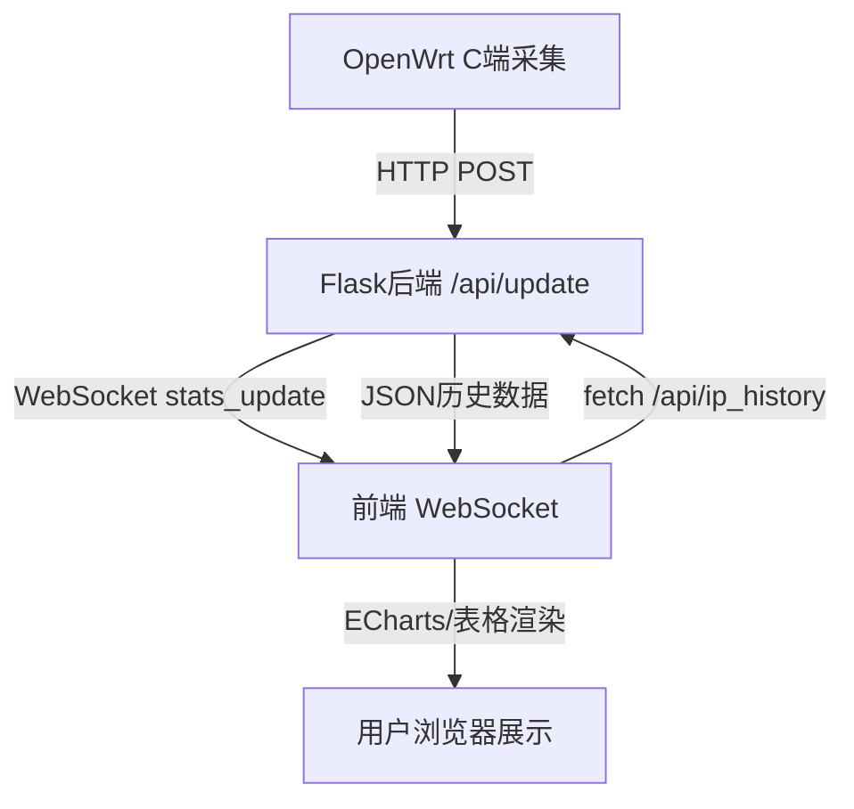

# Web 前后端通信机制说明

本系统采用 Flask 作为后端，原生 HTML+JS+ECharts 作为前端，二者通过 HTTP API 和 WebSocket 实现高效、实时的数据交互。

---

## 1. 通信方式概览

- **HTTP API**：前端通过 `fetch` 定时拉取后端接口（如 `/api/ip_history`），获取历史流量数据用于图表和表格展示。
- **WebSocket**：前端通过 WebSocket 监听后端推送（如 `stats_update` 事件），实现数据的实时刷新。

---

## 2. 后端主要接口说明（Flask）

| 路径                | 方法   | 说明                       |
|---------------------|--------|----------------------------|
| `/api/update`       | POST   | 上报全局或分IP分方向统计   |
| `/api/ip_history`   | GET    | 获取分IP分方向历史流量数据 |
| `/api/stats`        | GET    | 获取最新全局统计           |
| `/api/history`      | GET    | 获取全局历史统计           |
| `/api/packets`      | POST   | 上报单个数据包信息         |

- **WebSocket 事件**：
  - `stats_update`：有新统计数据时后端主动推送，前端收到后立即刷新。
  - `packet_update`：有新数据包信息时推送（前端可选监听）。

---

## 3. 前端通信与数据展示流程

### 3.1 定时拉取历史数据

前端每秒通过 `fetch` 拉取 `/api/ip_history`，用于刷新 ECharts 图表和表格：

```js
async function fetchAndUpdate() {
    const res = await fetch('http://<后端IP>:5000/api/ip_history');
    const history = await res.json();
    // 处理数据并刷新图表/表格
}
setInterval(fetchAndUpdate, 1000); // 每秒刷新
```

### 3.2 WebSocket 实时推送

前端建立 WebSocket 连接，监听 `stats_update` 事件，收到后立即调用 `fetchAndUpdate()`，实现毫秒级实时刷新：

```js
const wsProto = location.protocol === 'https:' ? 'wss' : 'ws';
const wsHost = location.hostname + ':5000';
const ws = new WebSocket(wsProto + '://' + wsHost + '/socket.io/?EIO=4&transport=websocket');
ws.onmessage = function(event) {
    if (event.data && event.data.indexOf('stats_update') !== -1) {
        fetchAndUpdate();
    }
};
```

### 3.3 数据展示

- **ECharts 图表**：分别展示各 IP 的发送/接收速率历史曲线。
- **表格**：展示每个 IP 的累计流量、峰值、平均速率等。

---

## 4. 典型数据流动流程图



---

## 5. 示例代码片段

### 5.1 后端 Flask 路由（节选）
```python
@app.route('/api/update', methods=['POST'])
def update_stats():
    data = request.json
    # ... 处理数据 ...
    socketio.emit('stats_update', data)
    return jsonify({'status': 'success'})

@app.route('/api/ip_history', methods=['GET'])
def get_ip_history():
    return jsonify(ip_stats_history)
```

### 5.2 前端 JS 拉取与 WebSocket
```js
// 定时拉取
setInterval(fetchAndUpdate, 1000);
// WebSocket 实时推送
const ws = new WebSocket('ws://<后端IP>:5000/socket.io/?EIO=4&transport=websocket');
ws.onmessage = function(event) {
    if (event.data && event.data.indexOf('stats_update') !== -1) {
        fetchAndUpdate();
    }
};
```

---

## 6. 总结

- 前端通过 HTTP API 定时拉取和 WebSocket 实时推送，保证数据高频、低延迟同步。
- 后端统一通过 Flask 路由和 SocketIO 事件对外提供数据。
- 典型场景：C 端采集 → 后端聚合 → 前端拉取/推送 → 图表/表格实时展示。 